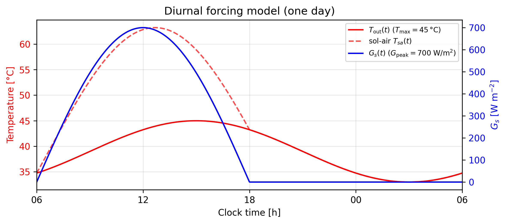
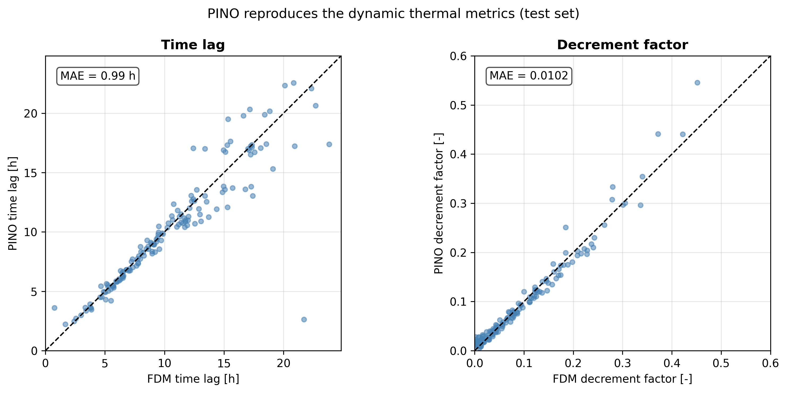
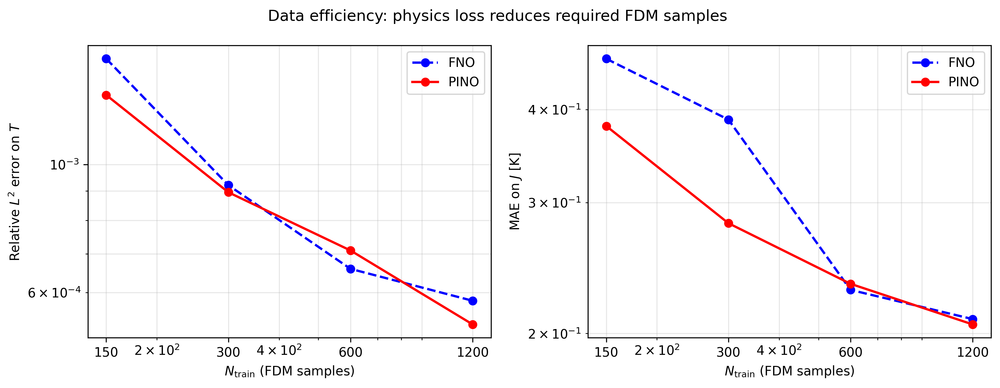
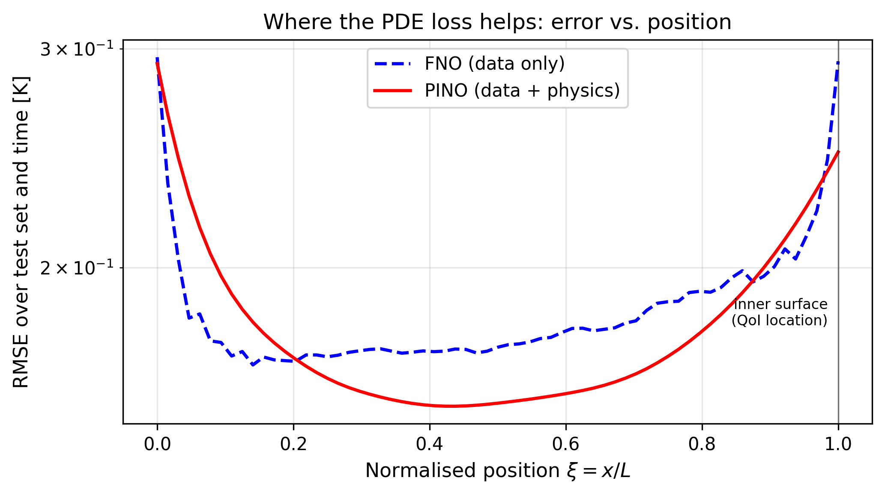

# A Physics-Informed Neural Operator for Thermal Ranking of Low-Cost Wall Materials in Hot-Dry Climates

[](https://python.org)
[](https://pytorch.org)
[](LICENSE)
[](https://neduet.edu.pk)
[](https://github.com/AkbarTheAnalyst/pino-wall-thermal)
[](https://doi.org/10.5281/zenodo.21311300)

> **Sindh Research Project SRSP-321** — NED University of Engineering & Technology, Karachi, Pakistan
> A two-stage FDM + Physics-Informed Neural Operator (PINO) framework for parametric transient thermal analysis of five indigenous Sindh wall materials under diurnal solar forcing, with ISO 13786 dynamic metrics, a data-efficiency study, and an FDM-confirmed climate regime map.

---

## Overview

This repository contains the full implementation of a two-stage computational framework for ranking low-cost wall materials by passive thermal performance. Stage 1 solves the **1D transient heat equation** with Robin boundary conditions under diurnal time-varying forcing:

$$\rho c_p \frac{\partial T}{\partial t} = \frac{\partial}{\partial x}\left(k_{\mathrm{eff}} \frac{\partial T}{\partial x}\right), \qquad -k_{\mathrm{eff}}\frac{\partial T}{\partial x}\Big|_{x=0} = h_{\mathrm{out}}\bigl(T_{\mathrm{out}}(t)-T\bigr) + \alpha_s G_s(t)$$

with a half-sine clear-sky irradiance profile $G_s(t)$ and a sinusoidal outdoor air temperature $T_{\mathrm{out}}(t)$ (maximum at 15:00, fixed 12 K swing). Five identical days are simulated per sample and the **final, periodic quasi-steady day** is extracted. Stage 2 trains a **PINO** (FNO backbone + PDE residual loss) to learn the parameter-to-solution operator $\boldsymbol{\mu} \mapsto T(x,t)$ over a nine-dimensional space of material, geometry, moisture, and climate parameters.

**Key findings:**
- The Crank–Nicolson FDM solver achieves second-order space–time convergence in the time-varying setting (**0.58 mK** inner-surface error at production resolution) and passes a Robin zero-drift test to **7.4×10⁻¹³ K**; every one of the 1500 dataset samples reaches a verified periodic state (periodicity ≤ 0.043 K).
- The trained PINO attains a relative L² field error of **5.14×10⁻⁴** and a **0.201 K** MAE on the peak inner-surface temperature, reproducing the FDM material ranking exactly.
- **The physics loss halves the FDM data budget**: PINO trained on 150 samples matches a data-only FNO trained on 300 (QoI MAE reductions of 18.8% at N=150 and 27.5% at N=300), and localises its benefit at the inner surface (**15.5% RMSE reduction at ξ = 1**, exactly where the QoI is evaluated).
- The periodic-day formulation yields the **ISO 13786 dynamic metrics** — thermal time lag and decrement factor — which the operator reproduces to **0.99 h** and **0.010** MAE respectively.
- A climate sweep of the trained operator, confirmed by **45 FDM ground-truth spot checks**, reveals a physically meaningful **heat-exclusion / heat-rejection regime boundary**: under sub-ambient outdoor conditions the ranking inverts in favour of conductive fired clay brick.

---

## Visual Results

<table>
<tr>
<td align="center" valign="top" width="50%">

<br>
<em>Diurnal forcing model: half-sine solar irradiance G<sub>s</sub>(t)
(06:00–18:00), sinusoidal outdoor air temperature T<sub>out</sub>(t)
(max at 15:00), and the resulting sol-air temperature T<sub>sa</sub>(t).</em>
</td>
<td align="center" valign="top" width="50%">

<br>
<em>PINO reproduces the ISO 13786 dynamic metrics across the test set:
time lag (MAE 0.99 h) and decrement factor (MAE 0.010),
PINO prediction vs. FDM ground truth.</em>
</td>
</tr>
<tr>
<td align="center" valign="top" width="50%">

<br>
<em>Data efficiency: PINO trained on 150 FDM samples matches a data-only
FNO trained on 300 — the physics loss halves the high-fidelity data budget
in the data-scarce regime.</em>
</td>
<td align="center" valign="top" width="50%">

<br>
<em>Where the PDE loss helps: test-set RMSE vs. position. The physics
loss preferentially reduces error at the inner surface ξ = 1
(15.5% RMSE reduction), the location where the QoI is evaluated.</em>
</td>
</tr>
</table>

---

## Material Ranking (FDM ground truth, nominal diurnal Sindh conditions)

Nominal conditions: T<sub>out,max</sub> = 45 °C, T<sub>in</sub> = 35 °C, G<sub>s,peak</sub> = 700 W m⁻², w₀ = 0, L = 0.25 m, final periodic day.

| Rank | Material | J<sub>FDM</sub> (°C) | J<sub>PINO</sub> (°C) | Time lag φ (h) | Decrement f (–) | Availability |
|------|----------|------------|-------------|--------|----------|--------------|
| 1 | Lime-stabilised bamboo panel | 36.37 | 37.08 | 13.4 | 0.016 | **L** |
| 2 | Clay–straw adobe | 37.07 | 37.41 | 10.1 | 0.039 | **H** |
| 3 | Mud brick (unfired) | 37.69 | 37.92 | 8.8 | 0.058 | **H** |
| 4 | Lime–mud composite | 38.36 | 38.39 | 7.7 | 0.082 | **M** |
| 5 | Fired clay brick | 38.76 | 38.70 | 7.6 | 0.090 | **H** |

**Recommendation:** among widely-available (**H**) materials, clay–straw adobe achieves the best dynamic cost–performance index (CPI<sub>dyn</sub> = 1.00) — only 0.70 K above the supply-constrained bamboo panel, with a 10.1 h time lag and the lowest cost (PKR 3,500/m³). Under sub-ambient outdoor conditions (heat-rejection regime), fired clay brick becomes optimal.

### Surrogate accuracy (held-out test set, N<sub>test</sub> = 150)

| Model | Rel. L² on T | MAE on J (K) |
|-------|--------------|--------------|
| FNO (data only) | 5.42×10⁻⁴ | 0.205 |
| **PINO (ours)** | **5.14×10⁻⁴** | **0.201** |

### Data-efficiency study (200-epoch cap, nested training subsets)

| N<sub>train</sub> | FNO MAE on J (K) | PINO MAE on J (K) | PINO gain |
|-------|-------|-------|-----------|
| 150 | 0.468 | **0.380** | −18.8% |
| 300 | 0.388 | **0.281** | −27.5% |
| 600 | **0.229** | 0.233 | — |
| 1200 | 0.209 | **0.206** | −1.6% |

---

## Two-Stage Pipeline

| Stage | Notebook | What it does | Runtime |
|-------|----------|--------------|---------|
| 1 — FDM data generation | `notebooks/fdm_solver_diurnal.ipynb` | Validations (MMS, Robin zero-drift, diurnal space–time convergence, periodicity/IC-independence), material ranking with dynamic metrics, 1500-sample LHS sweep, dataset export | ~20 min (CPU) |
| 2 — PINO training & analysis | `notebooks/pino_diurnal.ipynb` | FNO baseline + PINO training, evaluation, figures, ranking & cost tables, climate sweep + margin map, Sobol sensitivity (with CIs), optional data-efficiency study | ~1 h (+1–2 h optional) on a T4 GPU |

### FDM solver (Stage 1)
Crank–Nicolson with ghost-node Robin boundary rows; time-varying forcing enters the right-hand side **averaged over old/new time levels** (preserves O(Δt²)); the constant tridiagonal system is **LU-factorised once per run**. Production grid: N = 64 intervals, 4000 steps/day (Δt = 21.6 s), 5 days, final day stored on a 65 × 121 grid. Smart initial condition: Robin steady state of the time-mean forcing (spin-up accelerator; final day verified IC-independent).

### PINO model (Stage 2)

```
Input: (ξ, τ, μ₁…μ₉) ∈ ℝ¹¹ broadcast on the 65×121 (x,t) grid
  └─► 4 × [SpectralConv2d(width 32, modes 16×20) + pointwise Conv + GELU]
        └─► Projection head
Output: T̂(ξ, τ) ∈ ℝ (normalised)
```

| Hyperparameter | Value |
|----------------|-------|
| Spectral layers / width | 4 / 32 |
| Fourier modes (x, t) | 16, 20 |
| Optimiser | Adam, lr 10⁻³, weight decay 10⁻⁵ |
| Scheduler | ReduceLROnPlateau (×0.5, patience 10) |
| Early stopping | 30 epochs (max 300); FNO stopped at 176, PINO at 205 |
| Batch size / grad clip | 64 / 1.0 |
| PDE weight λ_T | 0.01 (pilot grid {0.001, 0.01, 0.1}) |
| Seed | `torch.manual_seed(42)` before each model (identical init & shuffle) |

Loss: $\mathcal{L} = \mathcal{L}_{\mathrm{data}} + \lambda_T\,\mathcal{L}^{\mathrm{PDE}}_T$, with the relative-L² data loss of Li et al. and a finite-difference PDE residual on interior grid points (chain-rule scaled per-sample for varying L; non-dimensionalised residual floor ≈ 3×10⁻³ on the periodic-day data).

---

## Installation & Running

Clone the repository:

```bash
git clone https://github.com/AkbarTheAnalyst/pino-wall-thermal.git
cd pino-wall-thermal
```

Install dependencies:

```bash
pip install -r requirements.txt
```

**Run order:** (1) `fdm_solver_diurnal.ipynb` top-to-bottom — all validations run before the sweep and any failure stops execution; produces `sindh_dataset_diurnal.npz` and `material_ranking_diurnal.csv`. (2) `pino_diurnal.ipynb` — expects both files (on Google Drive if using Colab, paths set via the `DRIVE` variable in Cell 1). The notebooks were developed on Google Colab (Stage 2 on a T4 GPU); to run locally, replace the `drive.mount` block with a local path. The optional data-efficiency cell (~1–2 h) can be disabled via `RUN_DATA_EFFICIENCY = False`.

The dataset and executed notebooks are also archived on Zenodo: [10.5281/zenodo.21311300](https://doi.org/10.5281/zenodo.21311300).

---

## Repository Structure

```
pino-wall-thermal/
├── notebooks/
│   ├── fdm_solver_diurnal.ipynb        # Stage 1: validated FDM data generation
│   └── pino_diurnal.ipynb              # Stage 2: PINO/FNO training + all analyses
├── data/
│   └── sindh_dataset_diurnal.npz       # 1500-sample LHS dataset (final periodic day)
├── results/
│   ├── material_ranking_diurnal.csv    # FDM ground-truth ranking + dynamic metrics
│   ├── fdm_convergence_diurnal.csv     # diurnal space–time convergence study
│   ├── data_efficiency.csv             # FNO vs PINO vs training-set size
│   ├── climate_sweep_results.csv       # 20×20 climate grid, all five materials
│   └── sobol_results.csv               # Sobol indices with confidence intervals
├── assets/                             # figures displayed in this README
│   ├── diurnal_forcing.png
│   ├── pino_dynamic_metrics_parity.png
│   ├── data_efficiency.png
│   └── pino_error_vs_position.png
├── requirements.txt
├── README.md
└── LICENSE
```

---

## Key Design Decisions

**Why a periodic final day instead of a single start-up window?**
A wall's comparative performance under cyclic solar loading is a property of its periodic quasi-steady response, not of an arbitrary initial condition. Simulating five identical days and extracting the last one removes start-up artefacts, makes the ISO 13786 time lag and decrement factor well-defined, and (a free bonus) eliminates the steep start-up transient from the saved window — dropping the finite-difference PDE-residual floor of the training data by ~30×.

**Why average the forcing in the Crank–Nicolson right-hand side?**
With time-varying boundary forcing, using only the new-time forcing silently degrades CN to first order in time. Averaging T_out and Q_solar over the old and new time levels preserves the O(Δt²) accuracy that the convergence study verifies.

**Why initialise at the mean-forcing steady state?**
For a linear problem, the time-mean of the periodic solution equals the steady solution under time-mean forcing. Initialising there removes the slow DC transient, so five spin-up days suffice even for the most sluggish wall (verified: worst-case day-4→day-5 residual 0.0125 K vs 0.161 K from a uniform IC).

**Why keep FDM as the ranking basis when PINO agrees?**
The operator's largest error (0.708 K, bamboo panel at the low-conductivity edge of the sampled range) is comparable to the bamboo–adobe gap itself. The FDM values therefore anchor all downstream tables; the PINO is the rapid-evaluation tool whose ranking agreement is verified rather than assumed — and it is what makes the 400-point climate sweep and 11,264-evaluation Sobol analysis affordable.

---

## References

- Li, Z., Kovachki, N., Azizzadenesheli, K., et al. (2021). Fourier neural operator for parametric partial differential equations. *ICLR*.
- Li, Z., Zheng, H., Kovachki, N., et al. (2024). Physics-informed neural operator for learning partial differential equations. *ACM/IMS Journal of Data Science*, 1(3).
- Raissi, M., Perdikaris, P., & Karniadakis, G. E. (2019). Physics-informed neural networks. *Journal of Computational Physics*, 378, 686–707.
- McKay, M. D., Beckman, R. J., & Conover, W. J. (1979). A comparison of three methods for selecting values of input variables. *Technometrics*, 21(2), 239–245.
- Saltelli, A., Annoni, P., Azzini, I., et al. (2010). Variance based sensitivity analysis of model output. *Computer Physics Communications*, 181(2), 259–270.
- ISO 13786:2017. Thermal performance of building components — Dynamic thermal characteristics — Calculation methods.
- ISO 6946:2017. Building components and building elements — Thermal resistance and thermal transmittance.
- Stackhouse, P. W., et al. (2016). NASA POWER — Surface meteorology and Solar Energy. NASA Langley Research Center.
- Khan, M. A., & Raees, F. (2026). A systematic study of physics-informed neural networks for level-set interface advection. *Machine Learning: Science and Technology*, under review (MLST-105622).

---

## Citation

If you use this work, please cite:

```bibtex
@article{akbar2026pino,
  author  = {Muhammad Akbar Khan and Fahim Raees},
  title   = {A Physics-Informed Neural Operator for Thermal Ranking of
             Low-Cost Wall Materials in Hot-Dry Climates},
  year    = {2026},
  note    = {Under review. First author ORCID: 0009-0001-7956-0080}
}

@dataset{akbar2026pino_data,
  author    = {Muhammad Akbar Khan and Fahim Raees},
  title     = {FDM dataset and PINO code for thermal ranking of
               low-cost wall materials (diurnal periodic-day formulation)},
  publisher = {Zenodo},
  year      = {2026},
  doi       = {10.5281/zenodo.21311300}
}
```

---

## Author

**Muhammad Akbar Khan**
Research Assistant, Sindh Research Project SRSP-321 · MS Applied Mathematics, NED University of Engineering & Technology
Research Interests: Scientific Machine Learning · Neural Operators · PINNs · Numerical PDEs

akbar.bsma1337@gmail.com · [GitHub](https://github.com/AkbarTheAnalyst) · [ORCID 0009-0001-7956-0080](https://orcid.org/0009-0001-7956-0080) · [Website](https://akbarkhan.dev) · [LinkedIn](https://linkedin.com/in/muhammad-akbar-khan-826129204)

Principal Investigator: Dr. Fahim Raees, Chairperson & Associate Professor, Department of Mathematics, NED University (PhD, TU Delft 2016)

---

*This work was conducted under Sindh Research Project SRSP-321 at NED University of Engineering & Technology, Karachi, Pakistan.*
