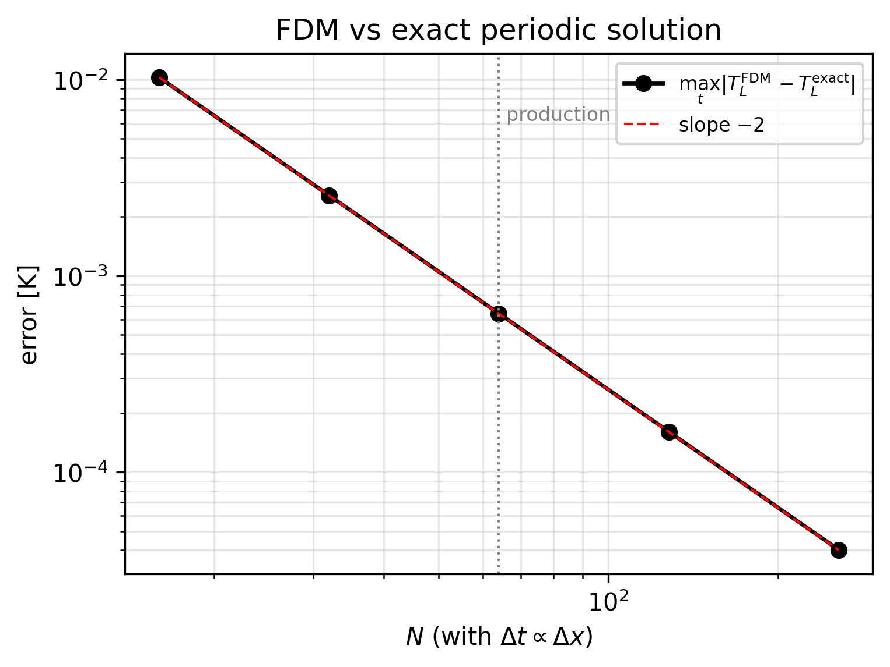
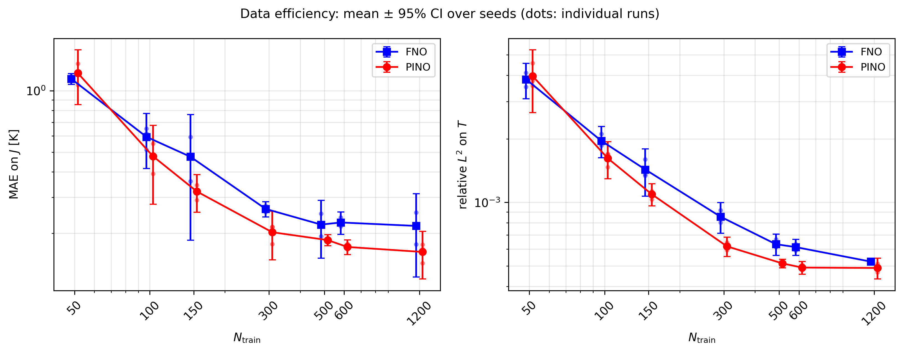
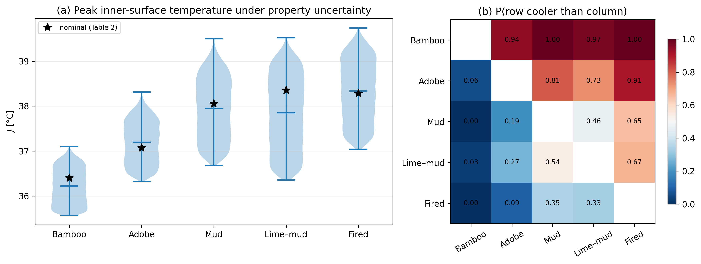
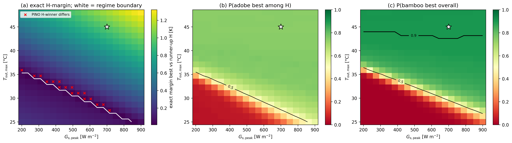

# A Physics-Informed Neural Operator for Thermal Ranking of Low-Cost Wall Materials in Hot-Dry Climates

[](https://python.org)
[](https://pytorch.org)
[](LICENSE)
[](https://neduet.edu.pk)
[](https://github.com/AkbarTheAnalyst/pino-wall-thermal)
[](https://doi.org/10.5281/zenodo.21311299)

> **Sindh Research Project SRSP-321** — NED University of Engineering & Technology, Karachi, Pakistan
> A two-stage FDM + Physics-Informed Neural Operator (PINO) framework for parametric transient thermal analysis of five indigenous Sindh wall materials under diurnal solar forcing, verified against an exact periodic solution, with a multi-seed data-efficiency study and an uncertainty-aware material ranking.

---

## Overview

This repository contains the full implementation of a two-stage computational framework for ranking low-cost wall materials by passive thermal performance. Stage 1 solves the **1D transient heat equation** with Robin boundary conditions under diurnal time-varying forcing:

$$\rho c_p \frac{\partial T}{\partial t} = \frac{\partial}{\partial x}\left(k_{\mathrm{eff}} \frac{\partial T}{\partial x}\right), \qquad -k_{\mathrm{eff}}\frac{\partial T}{\partial x}\Big|_{x=0} = h_{\mathrm{out}}\bigl(T_{\mathrm{out}}(t)-T\bigr) + \alpha_s G_s(t)$$

with a half-sine clear-sky irradiance profile $G_s(t)$ and a sinusoidal outdoor air temperature $T_{\mathrm{out}}(t)$ (maximum at 15:00, fixed 12 K swing). The forcing amplitudes are verified against NASA POWER satellite and reanalysis data for rural upper Sindh across three years and two grid cells — see [`data/nasa_power/`](data/nasa_power/) for the verification package. Five identical days are simulated per sample and the **final, periodic quasi-steady day** is extracted. Stage 2 trains a **PINO** (FNO backbone + PDE residual loss) to learn the parameter-to-solution operator $\boldsymbol{\mu} \mapsto T(x,t)$ over a nine-dimensional space of material, geometry, moisture, and climate parameters.

Because the problem is linear with constant coefficients and periodic forcing, its periodic steady state is also available **exactly in the frequency domain**. This exact solution is used as an independent reference for verifying the FDM solver and as the engine for the uncertainty analyses.

**Key findings:**
- The Crank–Nicolson FDM solver converges at **second order** against the exact periodic solution (**0.65 mK** at production resolution), passes a Robin zero-drift test to **7.4×10⁻¹³ K**, and all 1500 dataset samples agree with the exact solution (median **0.64 mK**).
- The representative PINO predicts the peak inner-surface temperature with an MAE of **0.167 K**, **25% below** a data-only FNO of the same architecture (worst-case error 0.83 K vs 1.44 K); on the full temperature field the two are equally accurate.
- **Across three seeds and seven training-set sizes, PINO is more accurate on the QoI in all 18 paired comparisons with N ≥ 100** (sign test p = 7.6×10⁻⁶; pooled reduction 23%, 95% CI 19–28%). PINO trained on 300 samples is as accurate as FNO trained on 1200; the physics loss gives no benefit at N = 50.
- The physics loss is spatially targeted: **26.6% RMSE reduction at the inner surface ξ = 1**, exactly where the QoI is evaluated. The optimal physics-loss weight decreases with data size (0.1 at N = 150, 0.01 at N = 1200).
- For this linear 1D problem the exact solution (~0.4 ms per case, batched) is cheaper than the PINO itself; the operator's value lies in the data-efficiency results and in extensions to problems without an exact solution.
- The first two places of the ranking **hold under material-property uncertainty**: the bamboo panel is coolest in 92% of Monte Carlo draws and clay–straw adobe is the coolest widely available material in 75%; the adobe vs mud-brick decision depends mainly on the two conductivities. The cost–performance ranking is insensitive to ±30% cost uncertainty.

---

## Visual Results

<table>
<tr>
<td align="center" valign="top" width="50%">

<br>
<em>FDM verification: second-order space–time convergence against
the exact periodic solution (0.65 mK at production resolution).</em>
</td>
<td align="center" valign="top" width="50%">

<br>
<em>Data efficiency over three seeds (mean ± 95% CI): PINO is more
accurate on the QoI in all 18 paired comparisons with N ≥ 100, and
keeps improving where FNO levels off.</em>
</td>
</tr>
<tr>
<td align="center" valign="top" width="50%">

<br>
<em>Ranking robustness under material-property uncertainty
(20,000 Monte Carlo draws per material): distribution of the peak
inner-surface temperature and pairwise probabilities.</em>
</td>
<td align="center" valign="top" width="50%">

<br>
<em>Ranking across the climate design space from the exact solution,
with the probability that each recommendation holds under property
uncertainty.</em>
</td>
</tr>
</table>

---

## Material Ranking (FDM ground truth, nominal diurnal Sindh conditions)

Nominal conditions: T<sub>out,max</sub> = 45 °C, T<sub>in</sub> = 35 °C, G<sub>s,peak</sub> = 700 W m⁻², w₀ = 0, L = 0.25 m, final periodic day. Material properties are taken from published measurements (mud brick: Cagnon et al. 2014; bamboo panel c<sub>p</sub>: Cui et al. 2018; fired clay brick: Maithel et al. 2023).

| Rank | Material | J<sub>FDM</sub> (°C) | J<sub>PINO</sub> (°C) | Time lag φ (h) | Decrement f (–) | Availability |
|------|----------|------------|-------------|--------|----------|--------------|
| 1 | Lime-stabilised bamboo panel | 36.40 | 36.63 | 12.9 | 0.018 | **L** |
| 2 | Clay–straw adobe | 37.07 | 37.11 | 10.1 | 0.039 | **H** |
| 3 | Mud brick (unfired) | 38.05 | 37.92 | 8.5 | 0.067 | **H** |
| 4 | Fired clay brick | 38.29 | 38.14 | 8.4 | 0.072 | **H** |
| 5 | Lime–mud composite | 38.36 | 38.16 | 7.7 | 0.082 | **M** |

**Recommendation:** among widely available (**H**) materials, clay–straw adobe performs best — only 0.67 K above the supply-constrained bamboo panel, with a 10.1 h time lag and the lowest cost (PKR 3,500/m³) — and has by far the best dynamic cost–performance index (1.39 K per 1000 PKR/m² relative to fired clay brick). Ranks 3–5 lie within 0.31 K of one another and are not robust to property uncertainty. The fired-brick region at mild outdoor conditions is largely a consequence of the prescribed indoor temperature.

### Surrogate accuracy (held-out test set, N<sub>test</sub> = 150, representative median-seed models)

| Model | RMSE on T (K) | Rel. L² on T | MAE on J (K) | Max. error on J (K) | R² on J |
|-------|---------------|--------------|--------------|---------------------|---------|
| FNO (data only) | 0.174 | 5.20×10⁻⁴ | 0.223 | 1.44 | 0.9955 |
| **PINO (ours)** | 0.175 | 5.11×10⁻⁴ | **0.167** | **0.83** | **0.9976** |

### Data-efficiency study (3 seeds, identical step budget, nested training subsets)

| N<sub>train</sub> | FNO MAE on J (K) | PINO MAE on J (K) | Paired reduction |
|-------|-------|-------|-----------|
| 50 | 1.143 ± 0.070 | 1.220 ± 0.365 | −6.6 ± 25.8% |
| 100 | 0.594 ± 0.179 | **0.477 ± 0.199** | 19.8 ± 19.2% |
| 150 | 0.475 ± 0.290 | **0.320 ± 0.067** | 30.3 ± 33.0% |
| 300 | 0.263 ± 0.023 | **0.202 ± 0.054** | 23.2 ± 15.9% |
| 500 | 0.221 ± 0.070 | **0.185 ± 0.012** | 15.0 ± 32.2% |
| 600 | 0.226 ± 0.029 | **0.171 ± 0.014** | 24.1 ± 3.4% |
| 1200 | 0.217 ± 0.095 | **0.162 ± 0.043** | 24.8 ± 14.0% |

Mean ± 95% confidence interval over three seeds.

---

## Two-Stage Pipeline

| Stage | Notebook | What it does | Runtime |
|-------|----------|--------------|---------|
| 1 — FDM data generation | `notebooks/fdm_solver_diurnal.ipynb` | Validations (MMS, Robin zero-drift, periodicity and initial condition), material ranking with dynamic metrics, 1500-sample LHS sweep, dataset export. Needs no input files and runs first. Cells A1–A9 and C1: exact periodic solution, verification against it, solver timing, ISO 13786 quantities, Monte Carlo rank reversal, exact climate maps, indoor-temperature dependence, longwave sky exchange, Sobol' indices, cost sensitivity | ~20 min + ~10 min (CPU) |
| 2 — PINO training & analysis | `notebooks/pino_diurnal.ipynb` | Uses the FDM outputs. Cells B1–B9: evaluation helpers and extended metrics, multi-seed data-efficiency study, λ sensitivity, representative models (loaded if provided, otherwise trained), validation figures, inference timing; PINO ranking, climate sweep and Sobol' sensitivity; comparison with the exact solution and Figure 12 (B9) | ~20 min with the provided models and results; ~8 h to retrain everything (T4 GPU) |

### FDM solver (Stage 1)
Crank–Nicolson with ghost-node Robin boundary rows; time-varying forcing enters the right-hand side **averaged over old/new time levels** (preserves O(Δt²)); the constant tridiagonal system is **LU-factorised once per run**. Production grid: N = 64 intervals, 4000 steps/day (Δt = 21.6 s), 5 days, final day stored on a 65 × 121 grid. Smart initial condition: Robin steady state of the time-mean forcing (spin-up accelerator; every stored final day agrees with the exact periodic solution to within 46 mK).

### Exact periodic solution
Each Fourier harmonic of the sol-air forcing has a closed-form solution of the heat equation with Robin conditions; the inner-surface temperature is the sum over harmonics. The forcing coefficients are known analytically, and 64 harmonics resolve J to within 1.3×10⁻⁵ K everywhere in the parameter space.

### PINO model (Stage 2)

```
Input: (ξ, τ, μ₁…μ₉) ∈ ℝ¹¹ broadcast on the 65×121 (x,t) grid
  └─► 4 × [SpectralConv2d(width 32, modes 16×20) + pointwise Conv + GELU]
        └─► Projection head
Output: T̂(ξ, τ) ∈ ℝ (normalised)
```

| Hyperparameter | Value |
|----------------|-------|
| Spectral layers / width | 4 / 32 |
| Fourier modes (x, t) | 16, 20 |
| Optimiser | Adam, lr 10⁻³, weight decay 10⁻⁵ |
| Training budget | at most 4000 optimiser steps; validation every 50 steps |
| Scheduler | ReduceLROnPlateau (×0.5 after 4 evaluations without improvement) |
| Early stopping | 12 evaluations without improvement; best checkpoint restored |
| Batch size / grad clip | min(64, N<sub>train</sub>) / 1.0 |
| PDE weight λ_T | 0.01 (selected on the validation set over {0.001, 0.01, 0.1, 1}) |
| Seeds | 3 per configuration; representative model = median seed (seed 2); training is deterministic |

Loss: $\mathcal{L} = \mathcal{L}_{\mathrm{data}} + \lambda_T\,\mathcal{L}^{\mathrm{PDE}}_T$, with the relative-L² data loss of Li et al. and a finite-difference PDE residual on interior grid points (chain-rule scaled per-sample for varying L; non-dimensionalised residual floor ≈ 3×10⁻³ on the periodic-day data).

---

## Installation & Running

Clone the repository:

```bash
git clone https://github.com/AkbarTheAnalyst/pino-wall-thermal.git
cd pino-wall-thermal
```

Install dependencies:

```bash
pip install -r requirements.txt
```

**Run order:** run the two notebooks in sequence; the dependency is one-way.

1. `fdm_solver_diurnal.ipynb` needs no input files. Run it top to bottom (CPU is sufficient): all validations run before the sweep and any failure stops execution. It writes `sindh_dataset_diurnal.npz` and `material_ranking_diurnal.csv` to `MyDrive/`, and the outputs of cells A1–A9 and C1 to `MyDrive/revision/`, including `climate_maps_exact.npz` and `sobol_exact.csv`.
2. `pino_diurnal.ipynb` uses these files. To reproduce the paper without retraining, first copy the two models from [`models/`](models/) and `data_efficiency_multiseed.csv` and `lambda_sensitivity.csv` from [`results/surrogate/`](results/surrogate/) to `MyDrive/revision/`; the multi-seed study (B4), the λ study (B6) and the representative models (B7) then skip any work whose results are present, and the notebook runs in about 20 min on a T4 GPU. Without these files it retrains everything (about 8 h); training is deterministic, so the results are reproduced exactly. The final cell (B9) compares the PINO results with the exact solution and draws Figure 12.

Every figure is saved as PNG and PDF. The notebooks were developed on Google Colab; to run locally, replace the `drive.mount` block with a local path and set `DRIVE` accordingly.

The dataset, models and executed notebooks are also archived on Zenodo: [10.5281/zenodo.21311299](https://doi.org/10.5281/zenodo.21311299).

---

## Repository Structure

```
pino-wall-thermal/
├── notebooks/
│   ├── fdm_solver_diurnal.ipynb        # Stage 1 (run first): FDM data, exact solution, cells A1–A9, C1
│   └── pino_diurnal.ipynb              # Stage 2: PINO/FNO training and analysis, cells B1–B9
├── data/
│   ├── sindh_dataset_diurnal.npz       # 1500-sample LHS dataset (final periodic day)
│   └── nasa_power/                     # climate forcing verification package
├── models/
│   ├── fno_rep_N1200_seed2.pt          # representative FNO (median seed)
│   └── pino_rep_N1200_seed2.pt         # representative PINO (median seed)
├── results/
│   ├── material_ranking_diurnal.csv    # FDM ground-truth ranking + dynamic metrics
│   ├── climate_sweep_results.csv       # PINO 20×20 climate grid, all five materials
│   ├── sobol_results.csv               # PINO Sobol' indices with confidence intervals
│   ├── verification/                   # FDM vs exact solution, solver timing, ISO 13786 quantities
│   ├── surrogate/                      # extended metrics, timing, multi-seed and λ studies
│   ├── uncertainty/                    # rank reversal, exact climate maps and Sobol', PINO comparison, longwave
│   └── cost/                           # fixed-baseline CPI and cost-sensitivity Monte Carlo
├── figures/                            # all figures used in the paper (PNG and PDF)
├── assets/                             # figures displayed in this README
├── requirements.txt
├── README.md
└── LICENSE
```

---

## Key Design Decisions

**Why a periodic final day instead of a single start-up window?**
A wall's comparative performance under cyclic solar loading is a property of its periodic quasi-steady response, not of an arbitrary initial condition. Simulating five identical days and extracting the last one removes start-up artefacts, makes the time lag and decrement factor well-defined, and (a free bonus) eliminates the steep start-up transient from the saved window — dropping the finite-difference PDE-residual floor of the training data by ~30×.

**Why average the forcing in the Crank–Nicolson right-hand side?**
With time-varying boundary forcing, using only the new-time forcing silently degrades CN to first order in time. Averaging T_out and Q_solar over the old and new time levels preserves the O(Δt²) accuracy that the convergence study verifies.

**Why initialise at the mean-forcing steady state?**
For a linear problem, the time-mean of the periodic solution equals the steady solution under time-mean forcing. Initialising there removes the slow DC transient, so five spin-up days suffice: on a low-diffusivity test wall the day-4→day-5 residual is 0.0125 K, against 0.161 K from a uniform IC, and every stored final day agrees with the exact periodic solution to within 46 mK.

**Why an exact periodic solution alongside the FDM?**
The problem is linear with constant coefficients and periodic forcing, so its periodic steady state can be computed exactly. This gives an independent, analytical reference for verifying the FDM solver and the whole dataset, and it is cheap enough (~0.4 ms per case, batched) to run the Monte Carlo, climate-map and Sobol' analyses directly.

**Why keep FDM as the ranking basis when PINO agrees?**
The operator's errors at the five material points (up to 0.24 K) are comparable to the differences among ranks 3–5 (0.07–0.31 K). The FDM values therefore anchor all downstream tables; the PINO's ranking agreement is verified rather than assumed.

**Why is the climate forcing archived alongside the code?**
The forcing amplitudes (the 900 W m⁻² upper bound of the swept peak irradiance and the fixed 12 K diurnal swing) are verified against NASA POWER data for rural upper Sindh across three consecutive years (2024–2026) and two independent MERRA-2 grid cells (Sukkur and Larkana). The raw CSVs, request settings, and derived statistics live in [`data/nasa_power/`](data/nasa_power/) so the verification is reproducible: the observed May–June swing spans roughly 7–23 K with a median near 16 K, making the adopted 12 K a deliberately conservative choice, and observed clear-day peak irradiance is 888–1017 W m⁻².

---

## References

- Li, Z., Kovachki, N., Azizzadenesheli, K., et al. (2021). Fourier neural operator for parametric partial differential equations. *ICLR*.
- Li, Z., Zheng, H., Kovachki, N., et al. (2024). Physics-informed neural operator for learning partial differential equations. *ACM/IMS Journal of Data Science*, 1(3).
- Raissi, M., Perdikaris, P., & Karniadakis, G. E. (2019). Physics-informed neural networks. *Journal of Computational Physics*, 378, 686–707.
- McKay, M. D., Beckman, R. J., & Conover, W. J. (1979). A comparison of three methods for selecting values of input variables. *Technometrics*, 21(2), 239–245.
- Saltelli, A., Annoni, P., Azzini, I., et al. (2010). Variance based sensitivity analysis of model output. *Computer Physics Communications*, 181(2), 259–270.
- ISO 13786:2017. Thermal performance of building components — Dynamic thermal characteristics — Calculation methods.
- ISO 6946:2017. Building components and building elements — Thermal resistance and thermal transmittance.
- Cagnon, H., Aubert, J. E., Coutand, M., & Magniont, C. (2014). Hygrothermal properties of earth bricks. *Energy and Buildings*, 80, 208–217.
- Maithel, S., Rawal, R., & Shukla, Y. (2023). Thermal properties of Indian masonry units & masonry for Eco-Niwas Samhita implementation. *Proc. ENERGISE 2023*.
- Berdahl, P., & Martin, M. (1984). Emissivity of clear skies. *Solar Energy*, 32(5), 663–664.
- NASA Langley Research Center (2026). NASA Prediction of Worldwide Energy Resources (POWER), Hourly and Daily Data, MERRA-2 and CERES SYN1deg. https://power.larc.nasa.gov (accessed July 2026).
- Khan, M. A., & Raees, F. (2026). A systematic study of physics-informed neural networks for the level-set interface advection. *Machine Learning: Science and Technology*, in press. https://doi.org/10.1088/2632-2153/ae8b74

---

## Citation

If you use this work, please cite:

```bibtex
@article{akbar2026pino,
  author  = {Muhammad Akbar Khan and Fahim Raees and Ubaida Fatima},
  title   = {A Physics-Informed Neural Operator for Thermal Ranking of
             Low-Cost Wall Materials in Hot-Dry Climates},
  year    = {2026},
  note    = {Under review. First author ORCID: 0009-0001-7956-0080}
}

@dataset{akbar2026pino_data,
  author    = {Muhammad Akbar Khan and Fahim Raees},
  title     = {A Physics-Informed Neural Operator for Thermal Ranking of
               Low-Cost Wall Materials in Hot-Dry Climates: Source Code and Data},
  publisher = {Zenodo},
  year      = {2026},
  doi       = {10.5281/zenodo.21311299}
}
```

---

## Author

**Muhammad Akbar Khan**
Research Assistant, Sindh Research Project SRSP-321 · MS Applied Mathematics, NED University of Engineering & Technology
Research Interests: Scientific Machine Learning · Neural Operators · PINNs · Numerical PDEs

akbar.bsma1337@gmail.com · [GitHub](https://github.com/AkbarTheAnalyst) · [ORCID 0009-0001-7956-0080](https://orcid.org/0009-0001-7956-0080) · [Website](https://akbarkhan.dev) · [LinkedIn](https://linkedin.com/in/muhammad-akbar-khan-826129204)

Principal Investigator: Dr. Fahim Raees, Chairperson & Associate Professor, Department of Mathematics, NED University (PhD, TU Delft 2016)

---

*This work was conducted under Sindh Research Project SRSP-321 at NED University of Engineering & Technology, Karachi, Pakistan.*
